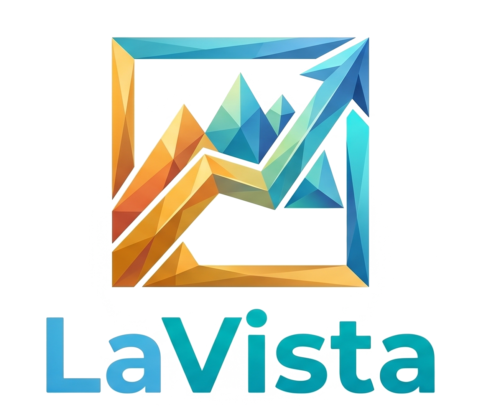
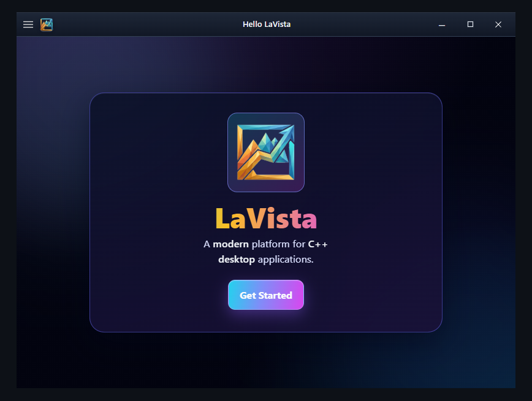
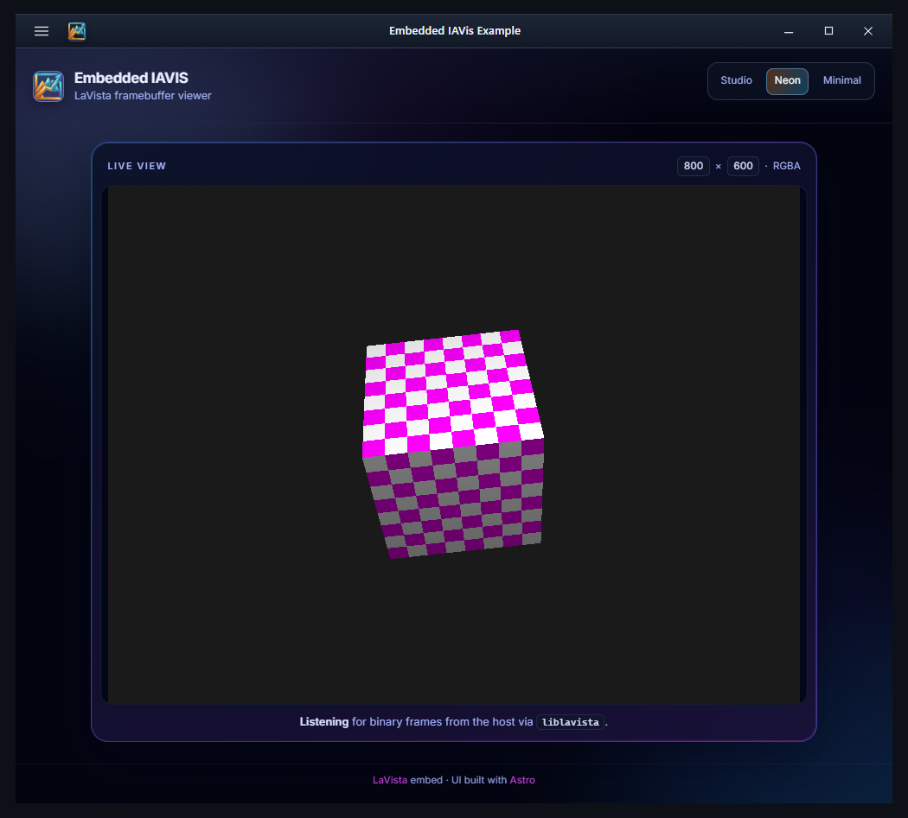

<div align="center">
  
  <br/>

  
  
  

  <p style="padding-top: 0.2rem;">
    <b>LaVista: A modern platform for C++ desktop apps.</b>
  </p>
</div>

> [!NOTE]
> LaVista has been migrated to a module-only API.
>
> If you're a current license holder, you should have received an email from IASoft detailing the changes, alongside a full migration guide, a repository link for header-only API security updates and a rationale for this decision.
>
> If you have (or previously held) a license to this library but didn't recieve the email, please raise a support ticket through IASoft Client Dashboard!

LaVista is a C++23 library designed to host single-page application (SPA) bundles within an **OS-native webview**. It provides robust windowing and display management for **Windows** and **Linux**.

Under the hood, LaVista is built on [LibAuxid](https://github.com/I-A-S/Auxid), leverages [webview](https://github.com/webview/webview) for the embedded browser. Other platforms currently use a minimal stub for development, but primary support and CI are focused on Windows and Linux x64.

<p align="center">
  
</p>
<p align="center">
  
</p>

## Features

- **Native Webviews** - WebView2 on Windows; GTK 4 and WebKitGTK on Linux (API 6.0).
- **Default Host Title Bar** - By default, LaVista installs a native-looking chrome strip above your SPA containing the window title and an embedded icon.
- **Custom HTML Title Bar** - Use `set_window_titlebar` to render your own HTML in a dedicated webview band with configurable height and drag-to-move behavior. Pass an empty string to remove the bar entirely and move chrome bindings to your main content.
- **Native Window Icons** - Supported platforms require `WindowCreateOptions.icon_path`. Pass a PNG, JPEG, or any stb_image-supported format to apply the image to the OS window and the default title bar.
- **Comprehensive Window API** - Create and destroy windows; manage titles, dimensions, and positions; or set up an optional drag strip (`set_window_drag_strip`) over a percentage of the client area.
- **Seamless Event Binding** - Connect your web layer to C++ using `bind_window_event` and `unbind_window_event` for string-keyed callbacks.
- **Display Management** - Query connected monitors via `get_displays` and target specific screens using `WindowCreateOptions.display_index`.
- **Easy SPA Integration** - Serve static assets (e.g., Astro or Vite `dist/` folders) simply by pointing `spa_bundle_path` to your build directory. The client application must use the `liblavista` JavaScript package to handle the host handshake and receive binary data.
- **CMake** - Exposes a static `LaVista` target with a C++23 module interface (`import lavista`). Tests and examples (`LaVista_BUILD_EXAMPLES`, `LaVista_BUILD_TESTS`) default to **ON** only when LaVista is the top-level project.

## Requirements

- **CMake** - Version 3.28+ (required for C++ modules and the provided [CMake presets](CMakePresets.json)).
- **Git** - Must include submodule support (LibAuxid is expected at `libauxid/`).
- **C++23 Compiler** - MSVC, Clang or GCC (15.2+), matching [LibAuxid](https://github.com/I-A-S/Auxid) and your chosen preset.

### Linux (Debian-based)

Typical packages (see [CI](.github/workflows/ci.yaml)):

```bash
sudo apt-get update
sudo apt-get install -y ninja-build clang pkg-config libgtk-4-dev libwebkitgtk-6.0-dev
```

Note: *X11 development libraries are required where CMake resolves `X11` (see `src/CMakeLists.txt`).*

### Windows

Use **Visual Studio 2026** with preset `LaVista-x64-windows`, or **Ninja** with `LaVista-x64-windows-msvc` / `LaVista-x64-windows-clang`. CI enables the MSVC environment with [ilammy/msvc-dev-cmd](https://github.com/ilammy/msvc-dev-cmd) before configuring.

## Quick start

Clone with submodules (LibAuxid is required):

```bash
git clone --recursive https://github.com/I-A-S/LaVista.git
cd LaVista

# Run this if you previously cloned without the --recursive flag:
# git submodule update --init --recursive
```

Configure and build using the provided presets:

**Linux (Clang, Ninja)**

```bash
cmake --preset LaVista-x64-linux
cmake --build --preset LaVista-x64-linux --config Release
```

**Windows (Visual Studio 2026)**

```bash
cmake --preset LaVista-x64-windows
cmake --build --preset LaVista-x64-windows --config Release
```

Additional presets for ARM64, Ninja + MSVC/Clang can be found in [`CMakePresets.json`](CMakePresets.json).

### Hello LaVista example

The `HelloLaVista` target loads a bundled [Astro](https://astro.build/) template located in `spa-template/`.

First, build the frontend:

```bash
cd spa-template
npm install
npm run build
cd ..
```

*Note: The frontend template depends on the local `JavaScript/liblavista` package.*

With examples enabled, execute the `HelloLaVista` binary from the repository root. This ensures that relative paths like `spa-template/dist` and `spa-template/public/logo-mark.png` resolve correctly. You can typically find the executable in `out/build/<preset>/bin/`, or within a `Release`/`Debug` subfolder depending on your generator.

### Frontend Integration (liblavista)

Your SPA must include the `liblavista` JavaScript package to successfully handshake with the C++ host and receive binary data.

```bash
# In your frontend project
npm install path/to/LaVista/JavaScript/liblavista
```

Then, import it in your application:

```javascript
import { onBinaryData } from "liblavista";

// The library automatically handles the host handshake on load.
// You can listen for binary data (like framebuffer updates) from the C++ host:
onBinaryData((buffer) => {
    // Process ArrayBuffer
});
```

### Using LaVista in your project

```cmake
# Note: LibAuxid must be available first (via submodule or FetchContent)
add_subdirectory(path/to/LaVista)

add_executable(my_app main.cpp)
target_link_libraries(my_app PRIVATE LaVista)
set_target_properties(my_app PROPERTIES CXX_SCAN_FOR_MODULES ON)
```

Public API: `import lavista;` (re-exports [LibAuxid](https://github.com/I-A-S/Auxid)), namespace `LaVista`. Use `<auxid/macros.hpp>` for `AU_TRY_*` helpers.

```cpp
#include <auxid/macros.hpp>

import lavista;

using namespace au;

LaVista::WindowCreateOptions opts;
opts.title = "My App";
opts.spa_bundle_path = "path/to/dist";
opts.icon_path = "path/to/icon.png";
opts.width = 1024;
opts.height = 768;

// Result<Window> - unwrap or AU_TRY_VAR (LibAuxid)
AU_TRY_VAR(window, LaVista::create_window(opts));

// Loop on update_window;
while (LaVista::update_window(window))
{
}

// call destroy_window when finished.
AU_TRY_DISCARD(LaVista::destroy_window(window));
```

## Documentation

Find the documentation at [https://docs.iasoft.dev/lavista](https://docs.iasoft.dev/lavista)

## License

Copyright © 2026 IASoft (PVT) LTD. Licensed under the [PolyForm Noncommercial License 1.0.0](https://polyformproject.org/licenses/noncommercial/1.0.0).
